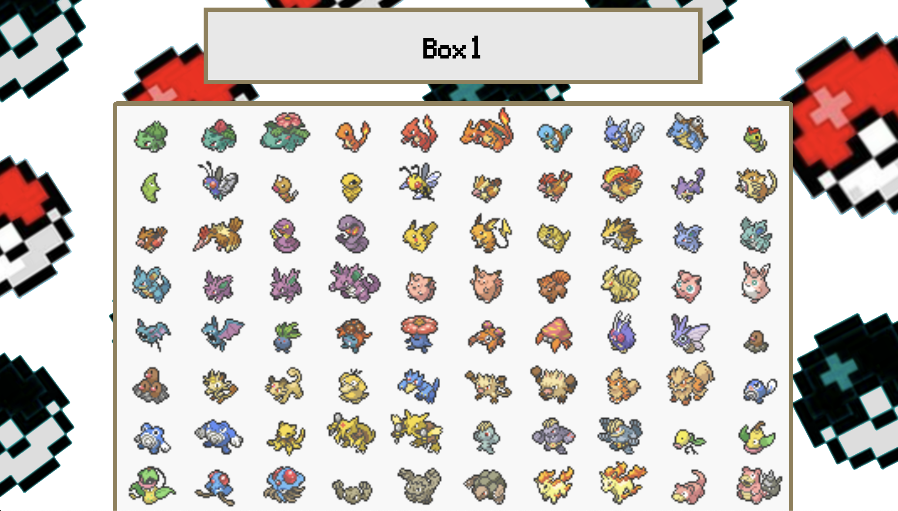
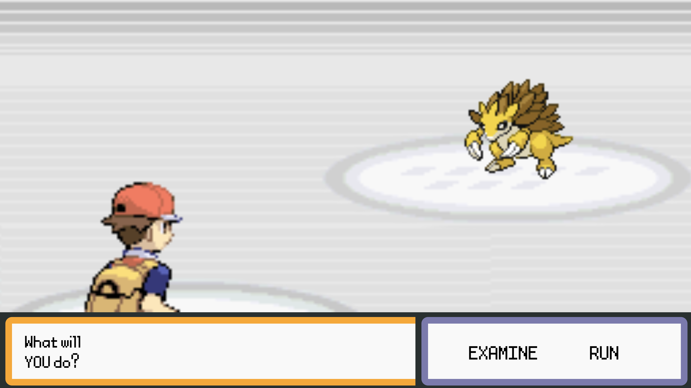
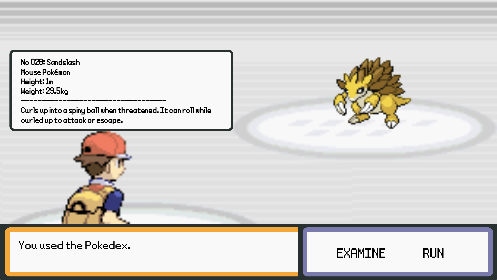

# Project 1

### Initial Idea/Inspiration

For this project, I intend to use the Pokeapi as my dataset. As a child, I had a catalogue featuring various Pokemon. I plan to create a Pokedex like web page where users are able to select from the generation one pokemon (will potentially scale to more). In the main page, the pokemon are displayed in their icon mode. Upon clicking on them, you will be able to "meet" this pokemon. I'll experiment to see if I am able to replicate the encounter animation as you would see in the games.

In the Pokemon games, there is normally a safari zone where you are able to see various different Pokemon and capture them. This is different from regular gameplay as you are not allowed to battle them. I intend to replicate a similar type of interaction but instead of capturing them, you would be given the option to examine them with your Pokedex which shows information about the Pokemon that you're seeing.

An image of the wireframe is shown below:

### Project Description

Upon completion of the project, it now encompasses a bit more features that planned. This project attemps to replicate the experience from the original Pokemon Fire Red/Leaf Green games. However, instead of battling other pokemon, it allows users to choose a Pokemon that they would like to meet and are given the options to examine it with the Pokedex to reveal information, or to run away. This project includes the dialogue with Professor Oak, the original cries of the Pokemon along with sound effects from the game such as running away or clicking. The encounter animation is also there and manually down with CSS.
The link to the web page is listed below:
https://chen-christopher.github.io/connectionsLab/project1/

### User Interactions

The interactions on this web page are relatively simple. At the beginning, the user is shown the opening sequence from the Pokemon games and by clicking it shows the next text.


Afterwards, users are able to click on any of the Pokemon icons in the Pokemon box.


This then opens the battle sequence where users are able to press either examine or run away.


By clicking on examine, the Pokedex entry opens up.


### Process

As of Feb 18 2022, I have the Pokemon icons displayed on the home page. This is done using fetch and limiting the pokemon to 151 with the query "https://pokeapi.co/api/v2/pokemon?limit=151". By doing so, I can get all of the generation one pokemon. I access the icon by going into data.sprites.versions["generation-vii"].icons["front_default"]. I realized that if I wanted to retain the previous information about the pokemon, I would have to save it somewhere. Thus I saved the query for the specific pokemon (for example bulbasaur would be https://pokeapi.co/api/v2/pokemon/1) in a dataset with the image. As a result, when I click on the Pokemon, I can directly use the dataset to send a request for the specific pokemon's information. To display the pokemon later on, I just use fetch again with that query and then access the wanted information.

After having the queries set up, I needed to complete a few more features. Firstly, I needed to structure the large div of Pokemon in a way that it makes sense. Currently, the Pokemon are just in a block with no real purpose; it needed some contextualization. I remembered that in the Pokemon games, Pokemon are stored in the PC and divided by boxes. I decided that it'd make perfect sense if I divided each generation by the box so generation one Pokemon would be in box 1. This just needed some CSS styling to resolve. Afterwards, I needed to create the gameplay loop: by clicking on one of the Pokemon, it would load the battle screen.

This entire process is a huge chunk as it is composed of adding the animations and loading the scene. In the function pokemonPage I had to remove the "none" class (that hides the entire battle div) while adding the none class to the Pokemon box. I then had to add the slide animation class to the character, the Pokemon, and the stage that each of them are standing on while removing the classes that were hiding them. Afterwards, I had to display the text and play the Pokemon cry (which I had to time with the slide in animation) by setting a setTimeout. Lastly, this function also set up the event listener for when "Examine" button that shows the Pokedex entry of the given Pokemon. I've attached a code snippet of the adding and removing classes below:

```js
pokemonImg.classList.remove("none");
rightBG.classList.remove("lowOpacity");
charImg.classList.remove("lowOpacity");
leftBG.classList.remove("lowOpacity");

pokemonImg.classList.add("slideLR");
rightBG.classList.add("slideLRBackground");
charImg.classList.add("slideRL");
leftBG.classList.add("slideRL");
```

Afterwards, I needed to implement the function that would show the information. Since the function pokemonPage has some of the previous information about the Pokemon, I set up the event listener to contain certain data like the height and width. I had to clean up some of the data that was pulled from the API and it just involved padding with 0's for the Pokemon id, removing whitespaces, and capitalizing names. One key thing to note is that I encountered a bug that whenever I switched Pokemon, the previous Pokedex entry would be there. To resolve this, I had to create the h3 element outside of the function so that it's only created once. Afterwards, it's just changing the inner text of the h3 elements with the data.

To fully complete the gameplay loop, I needed a reset function that played whenever the user clicked "run away" from the Pokemon encounter. This would take the user back to the Pokemon box and is done by removing and adding the none class to the appropriate block.

There are some other smaller functions which are purely for playing sounds or switching the screen. The transition that I used was simply displaying a black screen and then setting a time for it to disappear.

Now, I had the gameplay loop done, but I felt like the entire website was missing some context. If a user loaded into the web page right now, the user would just see Pokemon in the Pokemon box. I decided to create the beginning sequence from the Pokemon Fire Red/Leaf Green games and then have Professor Oak briefly explain what the website was doing. To load the different lines of text, I had an array of text and then by clicking on the text bar, the user could load the next piece of text. Once the user iterates through all of them, the Pokemon box page will load. I have attached the code snippet for this below:

```js

  counter: 0,
  messages: [
    "Welcome to the world of POKEMON!",
    "My name is OAK.",
    "People affectionately refer to me <br/> as the POKEMON professor.",
    "This world...",
    " ... is inhabitated by creatures far and wide <br/>called POKEMON",
    "For some people, POKEMON are pets.<br/>Others use them for battling.",
    "As for myself...",
    "I study POKEMON as a profession.",
    "We have recently invented a device that allows you <br /> to meet different kinds of POKEMON!",
    " To use it, simply click on a POKEMON <br/> you would like to meet.",
    "Let's get started!",
  ],
  showMessages: () => {
    app.clickSound.load();
    app.clickSound.play();
    if (app.counter < app.messages.length) {
      document.querySelector("#oakText").innerHTML = app.messages[app.counter];
      app.counter++;
    } else {
      document.querySelector("#opening_section").classList.add("none");
      document.querySelector(".pokeBox_block").classList.remove("none");
      app.switchScreen();
    }
  },

```

### Challenges

There were not any particular stand out challenges for this project. Most of them boiled down to actually reading and understanding the documentation as not all data was where I thought it would be. For example, the Pokedex description of the Pokemon was under flavor texts where I have to specifically query for the Pokemon species. Additionally, lots of the data required some type of clean up. The data wasn't consistent for all Pokemon as well as some of them were in a different language so I had to dig through a few Pokemon pages to figure out which best to extract. Another aspect that was particularly troublesome was the battle animation where the trainer and pokemon slide in from opposite sides. It required some Photoshop along with absolute positioning to get it done.

### Next Steps

1. Make the web page more game-like by introducing more features and mechanisms from the game. As it stands, there isn't much for the user to do other than look at Pokemon. Perhaps giving the user tasks to do or making it so that they have to meet all the Pokemon could be an interesting addition.

2. Currently, there's only Pokemon from generation one. Expanding it to all generations separated by boxes would thematically make sense and provide a more comprehensive Pokedex web page.

3. Provide more customizability such as picking the gender of the character or a name.

### Credit

Most of the images were taken from the [PokeApi](https://pokeapi.co/) or [Bulbagarden](https://archives.bulbagarden.net/wiki/Category:Game_sprites).
